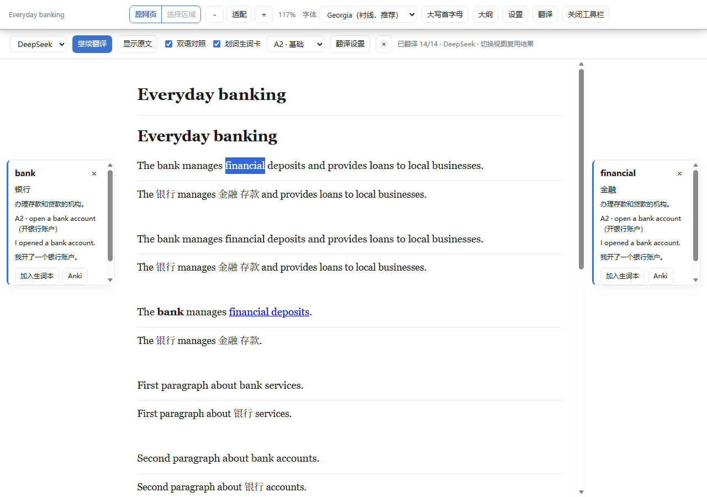
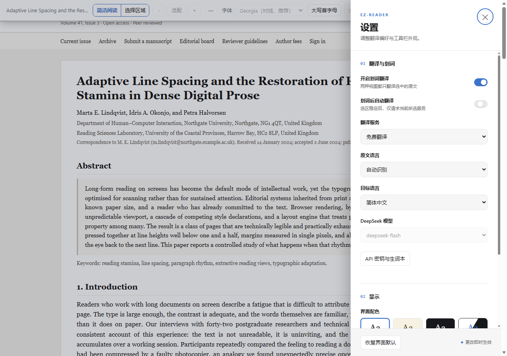
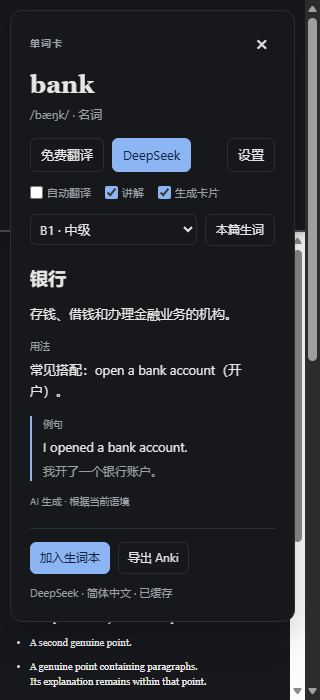

# EZ-Reader

**把网页变成清晰的阅读视图，把遇到的生词变成可复习的卡片。**

EZ-Reader 是一个面向 Edge / Chrome 的 Manifest V3 浏览器扩展。它将原网页、简洁阅读、全文翻译和词语学习放在同一套工具栏里，适合阅读英文文章、论文和长网页。

原生 JavaScript · 本机解析 PDF · 本地排版 · 可选免费翻译 / DeepSeek · Anki 导出

[快速安装](#快速安装) · [功能与使用](#功能与使用) · [翻译与学习](#翻译与学习) · [开发与验证](#开发与验证) · [详细使用说明](docs/guide.md)

## 界面预览

以下截图展示早期版本的阅读与生词卡界面，工具栏操作以当前使用说明为准。译文为模拟数据。

**双语阅读与两侧生词批注**



<details>
<summary>查看通用设置与深色单词卡</summary>

**原网页中也能调整翻译、划词与显示设置。**



**词语释义、用法和例句集中在单词卡中，可单独保存或导出。**



</details>

## 快速安装

### 下载发布包（推荐）

1. 打开 [Releases 下载页](https://github.com/Loki-0228/EZ-Reader/releases/latest)，在 Assets 中下载对应版本的 **EZ-Reader-v版本号.zip**。
2. 解压到固定文件夹，确认里面直接包含 `manifest.json`。已构建的发布包无需安装 Node.js。
3. 打开 Edge 的 `edge://extensions` 或 Chrome 的 `chrome://extensions`，开启「开发人员模式 / 开发者模式」。
4. 点击「加载解压缩的扩展」，选择上一步包含 `manifest.json` 的文件夹。
5. 打开普通网页，点击扩展图标，再点击「打开工具栏」。

发布页同时提供 `SHA256SUMS.txt`，可用于校验 ZIP 下载是否完整。更新时将新版本解压到原安装目录，在扩展管理页重新加载扩展，并刷新网页。

### 从源码构建

准备 **Node.js 24** 和 Chromium 119 或更新版本的 Edge / Chrome。项目无需安装 npm 依赖。

```bash
git clone https://github.com/Loki-0228/EZ-Reader.git
cd EZ-Reader
node tools/build.js
```

构建完成后，按上面的加载步骤选择项目中的 **`dist/extension`** 文件夹。

也可以下载仓库 ZIP，解压后在项目目录执行构建命令。`dist/` 由构建生成，不随源码提交。

更新时执行 `git pull` 和 `node tools/build.js`，然后在扩展管理页重新加载扩展，并刷新已打开的网页。

## PDF 与网页文档预览

在原生 PDF 页面点击扩展的「打开 PDF」，会打开保留 PDF 页面外观和可选文字层的视图，并直接显示工具栏。网页 PDF 控件中，先打开工具栏，再开启「翻译工具」栏中的「划词翻译」，选中文字即可显示浮窗。

PDF 原貌与文字阅读共用工具栏。点击「全文翻译」进入文字视图，按钮随后变为「显示原文」；再次点击返回原 PDF，缓存的译文会保留。点击「输入文字」可翻译输入或粘贴的内容。PPT 支持已移除。

[PDF 与 Canvas 使用说明](docs/documents.md) · [解析依赖与许可证](docs/third-party.md)

## 功能与使用

| 功能 | 原网页 | 简洁阅读 |
| --- | --- | --- |
| 全文翻译 | 直接替换页面文字，可恢复原文 | 支持双语对照或仅显示译文 |
| 划词翻译 | 开启后选中文字即显示浮窗 | 同左 |
| 输入文本翻译 | 输入或粘贴文字，复制译文 | 同左，支持拖动浮窗及 DeepSeek 风格提示词 |
| 单词首字母大写 | 通过样式显示，不改写原文 | 支持 |
| 通用设置 | 翻译服务、语言、自动划词翻译、配色等 | 同步使用相同偏好 |
| 字体、字号、行距、段间距、缩放与大纲 | — | 支持 |
| 选择指定区域 | 支持 | 返回原网页后使用 |
| 词语讲解、生词卡与侧边批注 | — | 支持 |

### 从原网页进入阅读

- 「简洁阅读 / 选择区域」是左右相邻的组合按钮：左侧进入阅读，右侧在原网页上指定要读的区域。
- 阅读模式中点击「原网页」可以返回；原网页中的链接、控件和事件处理保留。
- 工具栏在**当前浏览器窗口**中常驻。换页、刷新或打开新标签页后无需重新开启；其他浏览器窗口独立管理。
- 主工具栏最右侧的灰色 × 只隐藏主栏，保留翻译工具和当前阅读视图。翻译栏的「阅读工具」或扩展面板可重新打开主栏。重启浏览器或重新加载扩展后，需重新开启。
- 工具栏右端的「移到底部 / 移到顶部」用于切换工具栏停靠在窗口顶部还是底部。停靠到底部后，工具栏不再遮挡页面顶部，阅读视图的正文也完整显示在工具栏上方。停靠位置对所有网站生效，换页、刷新及重启浏览器后均保持不变。
- 普通段落不添加小点；真正的列表保留项目符号或编号。
- 浅色、深色、米色和跟随系统四种阅读配色，控件统一使用蓝色强调色。

「适配」按可用窗口宽度缩放正文，倍率范围为 60%–250%；也可手动缩放。它会改变正文的实际显示大小，工具栏保持独立大小。

### 快捷操作

| 操作 | 快捷方式 |
| --- | --- |
| 打开扩展面板 | `Alt + Shift + E` |
| 收起当前浮层、设置或取消选区 | `Esc` |
| 从阅读视图返回原网页 | 先关闭浮层，再按 `Esc` |

## 翻译与学习

### 选择翻译服务

在「翻译工具」栏的「译为」选框选择全文和划词共用的目标语言。「输入文字」窗口可单独选择另一种目标语言。翻译服务和原文语言可在「设置」中调整。

| 服务 | 配置 | 词语讲解 |
| --- | --- | --- |
| 免费翻译 | MyMemory，无需 API Key；受服务额度限制 | 英文词典，必要时回退到维基词典 |
| DeepSeek | 在「API 密钥与生词本」中填写自己的 API Key 并保存 | AI 按语境与 A1–C2 英语水平生成 |

默认自动识别原文、译为简体中文。DeepSeek 的调用费用由你的 API 账户承担；没有配置密钥时会提示，不会自动调用付费接口。

### 划词与全文翻译

主工具栏只保留一个「翻译工具」入口。展开后开启「划词翻译」，选中文字会自动显示浮窗，再点击浮层中的翻译按钮。也可勾选「划词后自动翻译」，让选区稳定后自动请求；**只调用当前选中的服务**。

翻译栏中的「输入文字」打开一个可拖动的浮窗，用来输入或粘贴文字进行翻译，不依赖页面选区；译文可一键复制。浮窗里还能填写「翻译风格提示词」（DeepSeek 专用，最多 500 字符），例如要求口语化或保留术语原词；提示词在翻译规则之后追加，留空时按默认风格翻译。点击「翻译工具」会先保存最新设置；浮窗中的「翻译设置」可用于填写 API Key 或指定原文语言。

在工具栏中点击「翻译 → 全文翻译」，即可分段翻译当前视图：

- 原网页优先翻译页面主体，再处理导航和侧栏等其他区域。
- 支持停止、继续与显示原文；重复段落和已有结果会复用缓存。
- 原网页与阅读视图之间切换时复用对应结果，切换双语显示也不会重新翻译。
- 开启翻译栏的「划词翻译」后，直接读取选中文字并显示浮窗。关闭此开关不影响全文和输入翻译。
- 免费服务达到额度限制时会显示错误并保留已完成内容，重试只处理未完成部分。

### DeepSeek 语境管理

首次翻译时，后台从当前文章节选中提取简短语境与术语，后续请求使用该摘要、相邻文字及本次选文，不持续累积整段对话历史。

语境按标签页、文档、页面地址与阅读区域隔离。换页、重新选择区域或更改翻译语言等关键配置时，旧语境会被清除；不会把上一个网站的语境带到新页面。文章节选最多 12000 个字符。

提示词见 [prompts.js](src/translation/prompts.js)，缓存与请求逻辑见 [service.js](src/translation/service.js)。

### 讲解、卡片和保存分别控制

1. **生成讲解**：给出简洁释义、用法与例句。DeepSeek 可按所选 A1–C2 水平，从长段落中挑选值得学习的词语。
2. **生成卡片**：生成可导出的词语卡片，可以与讲解独立开关。
3. **加入生词本**：手动保存，或另外勾选「将生成的卡片自动加入生词本」。

**生成卡片不等于自动保存。** 阅读器的侧边批注同样遵循这一规则，窄窗口下会收为底部卡片。

单卡和生词本都可导出 Anki；也支持通用 TSV。导出 Anki 后，在 Anki 的「文件 → 导入」中选择下载文件，使用 Basic 笔记类型，将两列映射为正面和背面。

## 数据与权限

- 阅读提取与排版在本地执行，不使用远程字体。PDF 解析库随扩展打包，不从 CDN 加载。
- 翻译会向所选服务发送相应文字；DeepSeek 语境分析会发送文章节选。开启自动划词翻译后，稳定的选区会自动发送。
- 词典查询使用当前词语；解释和例句的翻译可能产生额外请求。
- DeepSeek API Key 保存在扩展后台所属的本机 IndexedDB，不放入网页内容脚本可读的共享设置存储。
- 生词本保存在本机，导出由用户触发；不会自动连接 Anki 账户。
- 扩展需要网页访问权限，以便在不同网站提供常驻工具栏、选区和全文翻译。

浏览器内置页、扩展商店和内置 PDF 查看器通常无法注入网页工具栏。PDF 可通过「打开 PDF」进入带工具栏的 PDF 原貌视图，也可用浏览器右键翻译所选文本。扫描件 OCR 尚未实现。本地文件网址需在扩展设置中允许访问文件网址；本地文件选择器无需该设置。

## 开发与验证

主要在 **Windows + Edge** 下验证。浏览器测试使用独立配置目录和本地 fixture；翻译接口使用模拟响应，不消耗真实 DeepSeek 额度。

```bash
node tools/build.js
node tools/smoke-bundle.js
node tools/run-tests.js
node tools/browser-test.js
```

也可执行 `npm test` 或 `npm run verify`。浏览器测试需要允许 Chromium 创建子进程和 IPC 管道；可设置 `EZR_BROWSER` 指向其他 Chromium 浏览器的可执行文件。

按功能运行浏览器测试：

```bash
node tools/browser-test.js --only=toolbar
node tools/browser-test.js --only=translation,full-translation
node tools/screenshots.js paper.html
```

本地预览测试页面：

```bash
node tools/serve.js
```

打开 `http://localhost:8788/`。测试截图与浏览器配置保存在 `test-artifacts/`，不会提交到仓库。

### 项目结构

```text
src/
  core/          设置、排版规则、样式与渲染
  dom/           网页提取、翻译文本与原网页显示处理
  ui/            工具栏、选区、设置、翻译浮层与批注
  translation/   服务、提示词、词典、语境缓存与生词本
  pages/         扩展弹窗和配置页
  background/    浏览器窗口工具栏状态
fixtures/        浏览器测试示例页面
test/            单元测试
tools/           构建、测试与截图脚本
docs/            使用说明和界面截图
manifest.json    Manifest V3 扩展声明
```

更多细节见 [详细使用说明](docs/guide.md) 与 [模块接口约定](CONTRACTS.md)。
